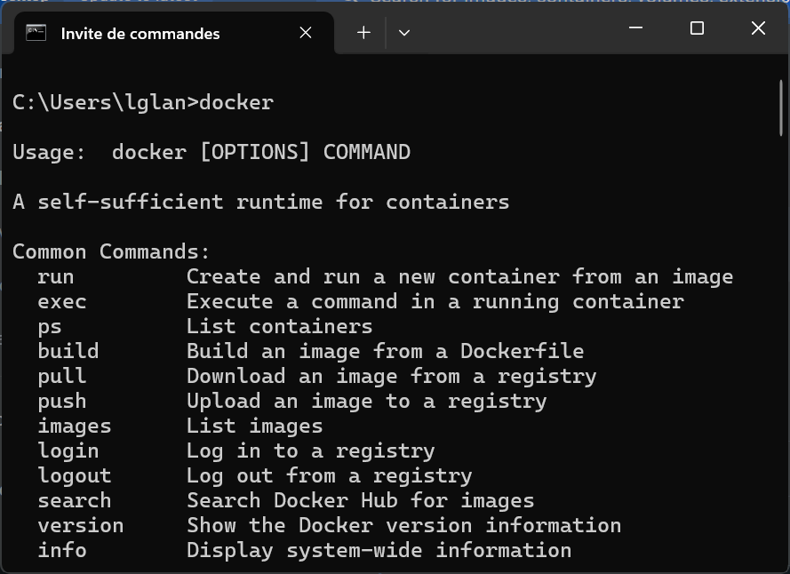
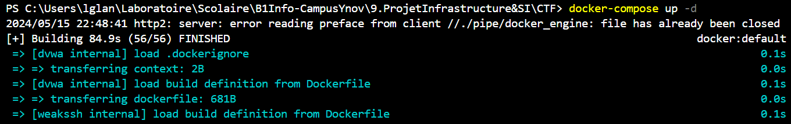
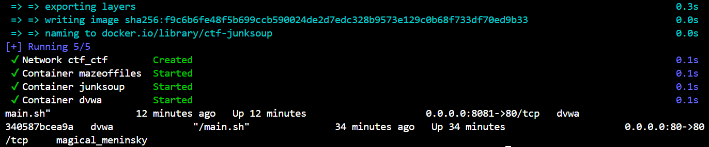
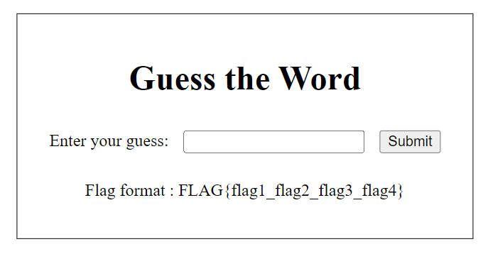
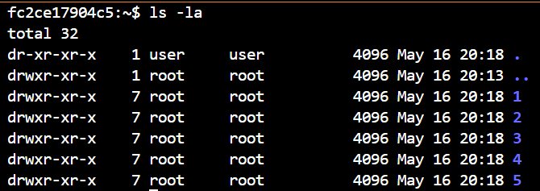
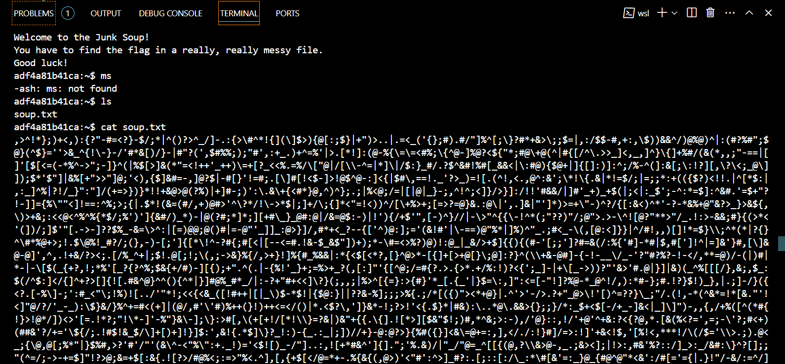
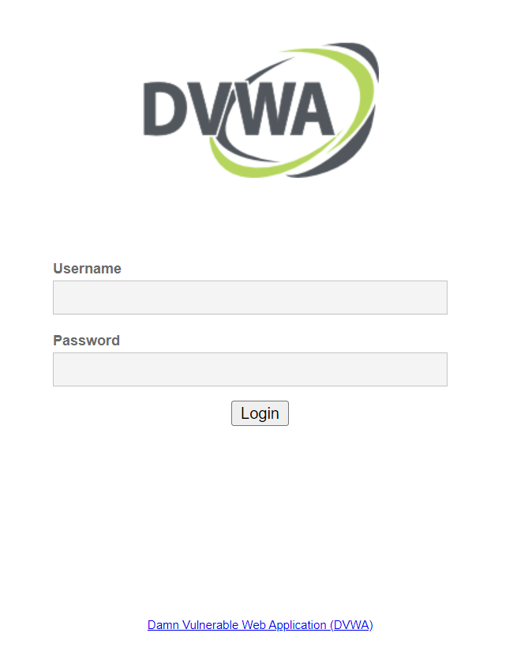
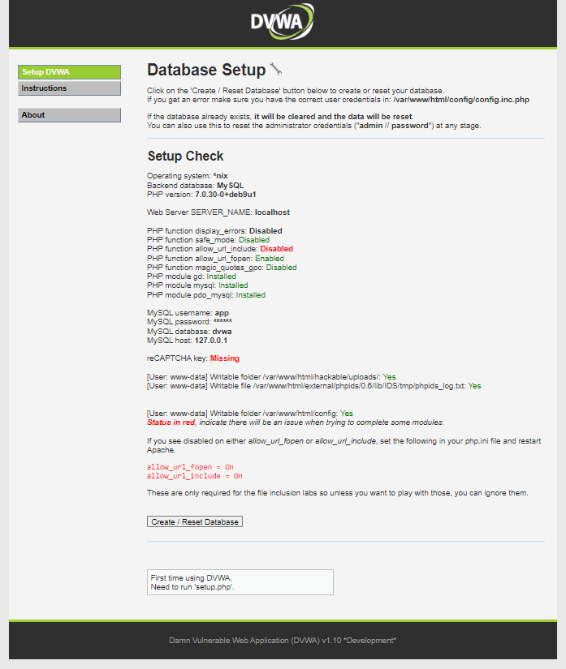
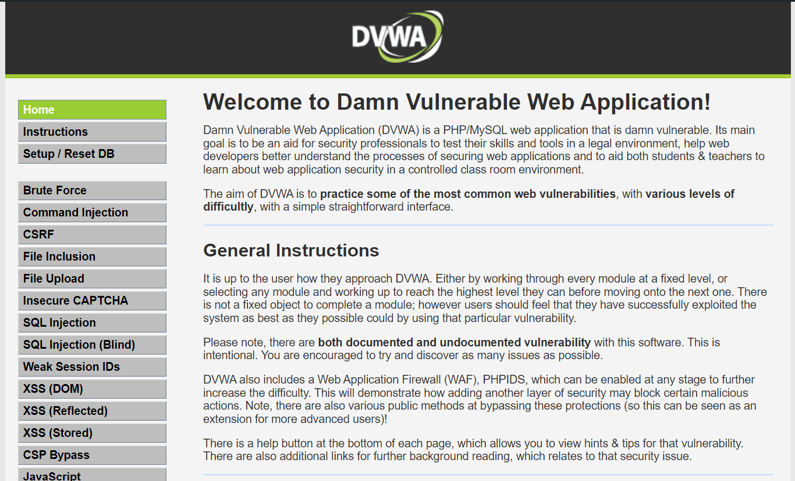

# Bienvenu⸱e⸱s sur le Tib&Lo_CTF !

## Présentation 💬

Ce CTF est le rendu de projet du module Infra de B1 Info de Lyon Ynov Campus. Il a été réalisé par Tibor LASSALLE et Loïc GLANOIS. Il consiste en une série de conteneurs Docker sur lesquels sont déployées des CTFs de différentes catégories et de faible difficulté.

## Prérequis 👷

Ci-dessous, vous trouverez les prérequis nécessaires et les procédures d'installation pour pouvoir utiliser ce CTF.

### Docker & Docker Compose (si vous voulez héberger le CTF)

Si vous voulez héberger le CTF, vous aurez besoin du moteur Docker et de Docker Compose. Vous pouvez les installer en suivant les instructions sur le site officiel de Docker. Pour cela, suivez **scrupuleusement** les instructions accessibles ici : https://docs.docker.com/get-docker/.



### Git (toujours si vous voulez héberger le CTF)

Le projet étant hébergé sur GitHub, vous aurez besoin de Git pour le cloner sur votre machine. Vous pouvez l'installer en suivant les instructions sur le site officiel de Git. Là encore, les consignes sont accessibles ici : https://git-scm.com/book/fr/v2/D%C3%A9marrage-rapide-Installation-de-Git.

Une fois Docker et Git installés, vous pouvez cloner ce dépôt Git (que vous devez également avoir installé) sur votre machine en utilisant la commande suivante (il est recommandé de le cloner dans un dossier vide) :
    
    ```bash
    git clone https://github.com/loicglanoisatynov/projet.infra.b1.tiblo.ctf.git
    ```

Une fois le dépôt cloné, vous pouvez vous rendre dans le dossier du projet en utilisant la commande suivante :

    ```bash
    cd projet.infra.b1.tiblo.ctf
    ```

### Golang

Pour pouvoir utiliser le flag checker, vous aurez besoin de Go. Vous pouvez l'installer en suivant les instructions sur le site officiel de Go. Les instructions sont accessibles ici : https://golang.org/doc/install.

## Utilisation

**Si vous êtes sous Windows, vous devez lancer Docker Desktop pour pouvoir utiliser Docker. Si vous êtes sous Linux, vous pouvez utiliser Docker directement en ligne de commande.**

Le repos correctement cloné, voici comment utiliser Docker Compose pour démarrer les conteneurs (toujours dans le dossier du projet) : 

    ```bash
    docker-compose up -d
    ```

Voici quelques captures d'écran pour vous montrer ce que vous devriez obtenir :
Au lancement de docker-compose :

Si il s'est terminé correctement, voici ce que vous devriez voir :


Lancez ensuite le serveur Golang avec la commande go run :

    ```bash
    go run site/main.go
    ```

Vous pouvez maintenant accéder au site web à l'adresse suivante : http://localhost:8080.


Pour arrêter les conteneurs, utilisez la commande suivante :

    ```bash
    docker-compose down
    ```

Pour réinitialiser le dossier (suite à une mauvaise manipulation par exemple), vous pouvez utiliser la commande suivante :

    ```bash
    git reset --hard
    ```

Pour réinitialiser le docker-compose, vous pouvez utiliser la commande suivante :

    ```bash
    docker-compose down -v
    ```

Pour jouer à plusieurs, vous pouvez partager l'adresse IP de votre machine avec les autres joueurs. Pour cela, vous pouvez utiliser la commande suivante :

    ```bash
    ipconfig
    ```

Vos camarades pourront alors se connecter à votre machine en utilisant l'adresse IP affichée dans la console, que vous mettrez à la place de `localhost` dans les instructions ci-dessous.

## CTFs

### Conteneur 1 : MazeOfFiles

Ce CTF est un labyrinthe de fichiers dans lequel vous devrez trouver le fichier `password.txt`. Pour cela, vous devrez vous connecter au conteneur et naviguer dans les fichiers pour trouver le bon fichier, ou trouver un moyen de le chercher plus efficacement. Vous devrez vous y connecter en tant qu'utilisateur `user` avec pour mot de passe `password`.



### Conteneur 2 : JunkSoup

Ce CTF consiste en un long fichier de caractères aléatoires dans lequel se cache un flag. Vous devrez trouver un moyen de retrouver le flag dans ce fichier. Vous devrez vous y connecter en tant qu'utilisateur `user` avec pour mot de passe `password`.



### Conteneur 3 : weakSSH

Ce CTF est un serveur SSH sur lequel vous devrez vous connecter. Pour cela, vous devrez trouver le mot de passe de l'utilisateur `user`. Pourquoi ne pas essayer une attaque par mot de passe ? Le flag est le mot de passe de l'utilisateur `user`.

### Conteneur 4 : DVWA-SQL :computer:

Ce CTF est une instance de Damn Vulnerable Web Application (DVWA) dans laquelle vous devrez trouver un moyen de récupérer le flag en exploitant une faille SQL. Récupérer le last_name de l'utilisateur `HackMe` pour valider le CTF. 

Pour le lancer individuellement, vous pouvez utiliser la commande suivante :

    ```bash
    docker build -t dvwa .
    docker run -d -p 80:80 dvwa
    ```



Sur votre navigateur rendez-vous à l'adresse : http://localhost:80

L'identifiant utilisateur est : admin

Le mot de passe est : password



Une fois sur la page setup.php, lancez la création de la base de données, après quoi vous serez redirigé vers la page index.php. Rendez-vous ensuite dans l'onglet SQL Injection pour réaliser le CTF. (Profitez-en pour vous familiariser avec les autres failles de DVWA ! Beaucoup de documentation est disponible sur le web.)



### Flag-Checker

Pour valider un CTF, vous devrez vous rendre sur le site web à l'adresse http://localhost:8080 que vous aurez lancé avec la commande
    ```bash
    go run site/main.go
    ```
et renseigner le flag que vous avez trouvé. Si le flag est correct, vous verrez un message de validation. Sinon, vous verrez un message d'erreur.

## Auteurs

Ce projet a été réalisé par Tibor LASSALLE et Loïc GLANOIS, étudiants en B1 Informatique à Lyon Ynov Campus.

## Licence

Ce projet est sous licence GNU GPL v3.0. Vous pouvez consulter le fichier LICENSE pour plus d'informations.